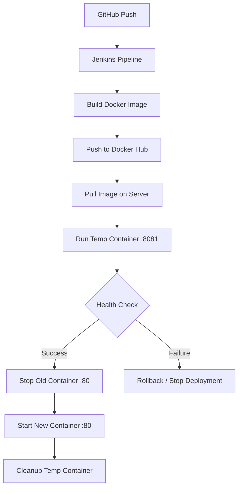

Here’s your content converted back into a **clean, well-structured README.md (proper Markdown format):**

---

# 📘 Jenkins + Docker Blue-Green CI/CD Pipeline (EC2 Setup)


---

## 🚀 Overview

This project implements a fully automated, production-grade CI/CD pipeline using a **Blue-Green deployment strategy** to ensure:

* ✅ Zero downtime
* ✅ Safe releases
* ✅ Automated health validation

---

## 🧰 Tech Stack

| Tool       | Purpose                       |
| ---------- | ----------------------------- |
| GitHub     | Source Control Management     |
| Jenkins    | CI/CD Automation Orchestrator |
| Docker Hub | Image Registry                |
| Docker     | Application Containerization  |
| AWS EC2    | Cloud Infrastructure Hosting  |

---

## ✨ Features

* 🚀 **Auto Build** — Triggered on every GitHub push (Webhooks)
* 🐳 **Containerization** — Docker images with dynamic tagging (`BUILD_NUMBER`)
* 📦 **Docker Hub Integration** — Secure image push
* ⬇️ **Auto Deployment** — Latest image pulled on server
* 🧪 **Pre-Prod Testing** — Runs on port `8081`
* 🔁 **Blue-Green Strategy** — Zero downtime switching
* ❤️ **Health Checks** — Automated validation via `curl`
* 🔄 **Self-Healing** — Rollback on failure
* 🤖 **Zero-Touch** — Fully automated pipeline

---

## 🧱 Architecture



---

## 🖥️ Server Requirements & Setup

### EC2 Instance

* **OS:** Ubuntu 20.04 LTS or newer
* **Ports Required:**

  * `22` → SSH
  * `80` → Production
  * `8081` → Testing
  * `8080` → Jenkins UI

---

## 🐳 1. Install Docker

```bash
sudo apt update
sudo apt install -y docker.io
sudo systemctl start docker
sudo systemctl enable docker

# Permissions
sudo usermod -aG docker $USER
newgrp docker
sudo chmod 666 /var/run/docker.sock

docker --version
```

---

## ⚙️ 2. Jenkins Setup

### Run Jenkins Container

```bash
docker run -d \
  --name jenkins \
  --restart unless-stopped \
  -p 8080:8080 \
  -p 50000:50000 \
  -v jenkins_home:/var/jenkins_home \
  -v /var/run/docker.sock:/var/run/docker.sock \
  -e TZ=Asia/Kolkata \
  jenkins/jenkins:lts
```

### Unlock Jenkins

```bash
docker exec jenkins cat /var/jenkins_home/secrets/initialAdminPassword
```

Access: `http://<YOUR-EC2-IP>:8080`

---

## 🔐 Jenkins Configuration

### Install Plugins

* GitHub Integration Plugin
* Docker Pipeline

### Add Credentials

#### GitHub

* Kind: Username & Password
* ID: `github-creds`

#### Docker Hub

* Kind: Username & Password
* ID: `dockerhub-creds`

---

## 📁 Project Structure

```text
.
├── Dockerfile
├── index.html
└── Jenkinsfile
```

---

## 🚀 Jenkins Pipeline

```groovy
pipeline {
    agent any

    environment {
        DOCKERHUB_REPO = "ayush2027/jenkins-test-app"
        IMAGE_TAG      = "${BUILD_NUMBER}"

        PROD_CONTAINER = "jenkins-test-container"
        TEMP_CONTAINER = "jenkins-test-new"

        PROD_PORT      = "80"
        TEMP_PORT      = "8081"
    }

    stages {

        stage('Checkout Code') {
            steps {
                checkout scm
            }
        }

        stage('Build Docker Image') {
            steps {
                sh '''
                    echo "🔨 Building Docker image..."
                    docker build -t $DOCKERHUB_REPO:$IMAGE_TAG .
                '''
            }
        }

        /* =========================
           🛡️ TRIVY SCAN ADDED HERE
        ========================== */
        stage('Trivy Scan (Non-blocking)') {
            steps {
                sh '''
                    echo "🛡️ Running Trivy security scan..."

                    docker run --rm \
                        -v /var/run/docker.sock:/var/run/docker.sock \
                        -v $WORKSPACE:/workspace \
                        aquasec/trivy image \
                        --severity CRITICAL,HIGH \
                        --exit-code 0 \
                        --format json \
                        --output /workspace/trivy-report.json \
                        $DOCKERHUB_REPO:$IMAGE_TAG
                '''
            }
        }

        stage('Login to DockerHub') {
            steps {
                withCredentials([usernamePassword(
                    credentialsId: 'dockerhub-creds',
                    usernameVariable: 'DOCKER_USER',
                    passwordVariable: 'DOCKER_PASS'
                )]) {
                    sh '''
                        echo "$DOCKER_PASS" | docker login -u "$DOCKER_USER" --password-stdin
                    '''
                }
            }
        }

        stage('Push Image to DockerHub') {
            steps {
                sh '''
                    echo "📤 Pushing image to DockerHub..."
                    docker push $DOCKERHUB_REPO:$IMAGE_TAG
                '''
            }
        }

        stage('Pull Image') {
            steps {
                sh '''
                    echo "📥 Pulling image: $IMAGE_TAG"
                    docker pull $DOCKERHUB_REPO:$IMAGE_TAG
                '''
            }
        }

        stage('Deploy Temp Container') {
            steps {
                sh '''
                    echo "🚀 Starting temp container..."

                    docker rm -f $TEMP_CONTAINER || true

                    docker run -d \
                        --name $TEMP_CONTAINER \
                        -p $TEMP_PORT:80 \
                        $DOCKERHUB_REPO:$IMAGE_TAG
                '''
            }
        }

        stage('Health Check') {
            steps {
                sh '''
                    echo "🩺 Running health check..."
                    sleep 10

                    for i in $(seq 1 5); do
                        if docker exec $TEMP_CONTAINER curl -f http://localhost; then
                            echo "✅ Health check passed"
                            exit 0
                        fi
                        echo "⏳ Retry $i..."
                        sleep 5
                    done

                    echo "❌ Health check failed"
                    docker logs $TEMP_CONTAINER
                    docker rm -f $TEMP_CONTAINER
                    exit 1
                '''
            }
        }

        stage('Switch to Production') {
            steps {
                sh '''
                    echo "🔄 Switching traffic to new version..."

                    docker rm -f $PROD_CONTAINER || true

                    docker run -d \
                        --name $PROD_CONTAINER \
                        --restart unless-stopped \
                        -p $PROD_PORT:80 \
                        $DOCKERHUB_REPO:$IMAGE_TAG

                    docker rm -f $TEMP_CONTAINER || true

                    echo "🎉 Deployment successful: version $IMAGE_TAG"
                '''
            }
        }
    }

    post {
        success {
            echo "✅ SUCCESS: Version ${IMAGE_TAG} deployed successfully"
            archiveArtifacts artifacts: 'trivy-report.json', allowEmptyArchive: true
        }

        failure {
            echo "❌ FAILED: Cleaning up temp container"
            sh 'docker rm -f jenkins-test-new || true'
        }
    }
}
```

---

## ⚠️ Troubleshooting

| Issue             | Fix Command                           |
| ----------------- | ------------------------------------- |
| Port 80 conflict  | `docker ps` → `docker stop <ID>`      |
| Push denied       | Check Docker Hub repo + login         |
| Container failure | `docker logs jenkins-test-new`        |
| Permission denied | `sudo chmod 666 /var/run/docker.sock` |

---

## 🎯 Final Result

🎉 You now have a **production-ready CI/CD pipeline** that:

* Builds automatically
* Tests safely
* Deploys with zero downtime

**Fully automated. No manual intervention required.** 🚀

---

