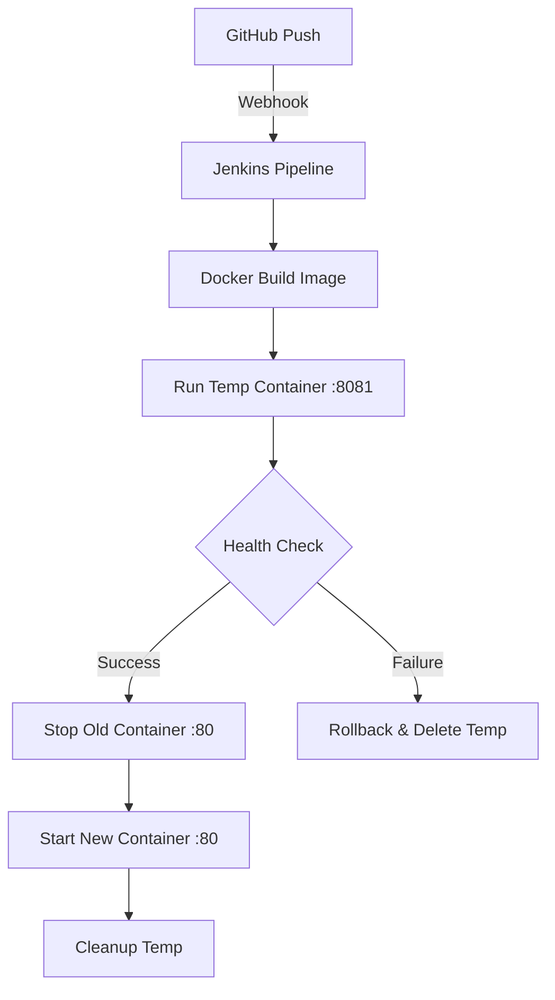

This is the complete, formatted README. You can copy the entire block below and paste it directly into your `README.md` file on GitHub.

-----

# 📘 Jenkins + Docker Blue-Green CI/CD Pipeline (EC2 Setup)

[](https://www.jenkins.io/)
[](https://www.docker.com/)
[](https://aws.amazon.com/)

## 🚀 Overview

This project implements a fully automated, production-grade CI/CD pipeline. It utilizes a **Blue-Green deployment strategy** to ensure zero downtime and automated health validation before switching traffic.

| Tool | Purpose |
| :--- | :--- |
| **GitHub** | Source Control Management |
| **Jenkins** | CI/CD Automation Orchestrator |
| **Docker** | Application Containerization |
| **AWS EC2** | Cloud Infrastructure Hosting |

-----

## ✨ Features

  * ✅ **Auto Build:** Triggers on every GitHub push.
  * ✅ **Containerization:** Clean Docker image creation.
  * ✅ **Blue-Green Strategy:** Minimizes deployment risk.
  * ✅ **Pre-Prod Testing:** Temporary environment testing on port `8081`.
  * ✅ **Health Checks:** Automated `curl` validation before release.
  * ✅ **Self-Healing:** Automatic rollback on failure.
  * ✅ **Zero-Touch:** Completely hands-off deployment flow.

-----

## 🧱 Architecture



-----

## 🖥️ Server Requirements & Setup

### EC2 Instance Specifications

  * **OS:** Ubuntu 20.04 LTS or newer
  * **Security Group Inbound Rules:**
      * `22` (SSH)
      * `80` (Application Production)
      * `8081` (Application Testing)
      * `8080` (Jenkins UI)

### 🐳 1. Install Docker

```bash
sudo apt update
sudo apt install -y docker.io
sudo systemctl start docker
sudo systemctl enable docker

# Fix permissions (Allow Jenkins and User to run Docker)
sudo usermod -aG docker $USER
newgrp docker
sudo chmod 666 /var/run/docker.sock

docker --version
```

### ⚙️ 2. Jenkins Installation

#### 2.1 Run Jenkins Container

Deploy Jenkins with persistent storage and correct timezone:

```bash
docker run -d \
  --name jenkins \
  --restart unless-stopped \
  -p 8080:8080 \
  -p 50000:50000 \
  -v jenkins_home:/var/jenkins_home \
  -v /var/run/docker.sock:/var/run/docker.sock \
  -e TZ=Asia/Kolkata \
  jenkins/jenkins:lts
```

#### 2.2 Unlock Jenkins

Access `http://<YOUR-EC2-IP>:8080`. Get your admin password from the logs:

```bash
docker exec jenkins cat /var/jenkins_home/secrets/initialAdminPassword
```

*Select **"Install Suggested Plugins"** to proceed.*

-----

## 🔐 Jenkins Configuration

### 3.1 Install Automation Plugins

Navigate to **Manage Jenkins** → **Plugins** → **Available Plugins** and install:

  * ✅ **GitHub Integration Plugin**
  * ✅ **Docker Pipeline**

### 3.2 Add GitHub Credentials

1.  Go to **Manage Jenkins** → **Credentials** → **(global)** → **Add Credentials**.
2.  **Kind:** Username with password.
3.  **Username:** Your GitHub username.
4.  **Password:** Your GitHub Personal Access Token (PAT).
5.  **ID:** `github-creds` (Save this for your Jenkinsfile).

### 3.3 Configure GitHub Webhook

1.  Go to your **GitHub Repository** → **Settings** → **Webhooks** → **Add webhook**.
2.  **Payload URL:** `http://<YOUR-EC2-IP>:8080/github-webhook/` (Ensure the trailing `/` is there).
3.  **Content type:** `application/json`.
4.  Click **Add webhook**.

-----

## 📁 Project Structure

```text
.
├── Dockerfile          # Container configuration
├── index.html          # Web application source
└── Jenkinsfile         # CI/CD Pipeline Logic
```

### 🐳 Dockerfile

```dockerfile
FROM nginx:alpine
RUN apk add --no-cache curl
COPY . /usr/share/nginx/html
```

-----

## 🚀 Jenkins Pipeline (The CI/CD Logic)

```groovy
pipeline {
    agent any

    environment {
        IMAGE_NAME = "jenkins-test-app"
        PROD_CONTAINER = "jenkins-test-container"
        TEMP_CONTAINER = "jenkins-test-new"
        PROD_PORT = "80"
        TEMP_PORT = "8081"
    }

    stages {
        stage('Checkout') {
            steps {
                checkout scm
            }
        }

        stage('Build Image') {
            steps {
                sh 'docker build -t $IMAGE_NAME:latest .'
            }
        }

        stage('Deploy Temp Container') {
            steps {
                sh '''
                docker rm -f $TEMP_CONTAINER || true
                docker run -d --name $TEMP_CONTAINER -p $TEMP_PORT:80 $IMAGE_NAME:latest
                '''
            }
        }

        stage('Health Check') {
            steps {
                sh '''
                sleep 10
                for i in {1..5}; do
                  if docker exec $TEMP_CONTAINER curl -f http://localhost; then
                    echo "Health Check Passed"
                    exit 0
                  fi
                  echo "Retry $i..."
                  sleep 5
                done
                echo "Health Check Failed"
                exit 1
                '''
            }
        }

        stage('Switch Deployment') {
            steps {
                sh '''
                OLD=$(docker ps --filter "publish=80" -q)
                if [ ! -z "$OLD" ]; then
                    docker stop $OLD && docker rm $OLD
                fi
                docker run -d --name $PROD_CONTAINER --restart unless-stopped -p $PROD_PORT:80 $IMAGE_NAME:latest
                docker rm -f $TEMP_CONTAINER || true
                '''
            }
        }
    }

    post {
        failure {
            sh 'docker rm -f $TEMP_CONTAINER || true'
        }
    }
}
```

-----

## ⚠️ Troubleshooting

| Problem | Command to Fix |
| :--- | :--- |
| **Port 80 Conflict** | `docker ps` then `docker stop <ID>` |
| **Container Failure** | `docker logs jenkins-test-new` |
| **Permission Denied** | `sudo chmod 666 /var/run/docker.sock` |

-----

## 🚀 Final Result

> [\!IMPORTANT]
> **Success:** You now have a production-ready pipeline that builds, tests, and deploys without human intervention. Zero downtime achieved\! 🏁
